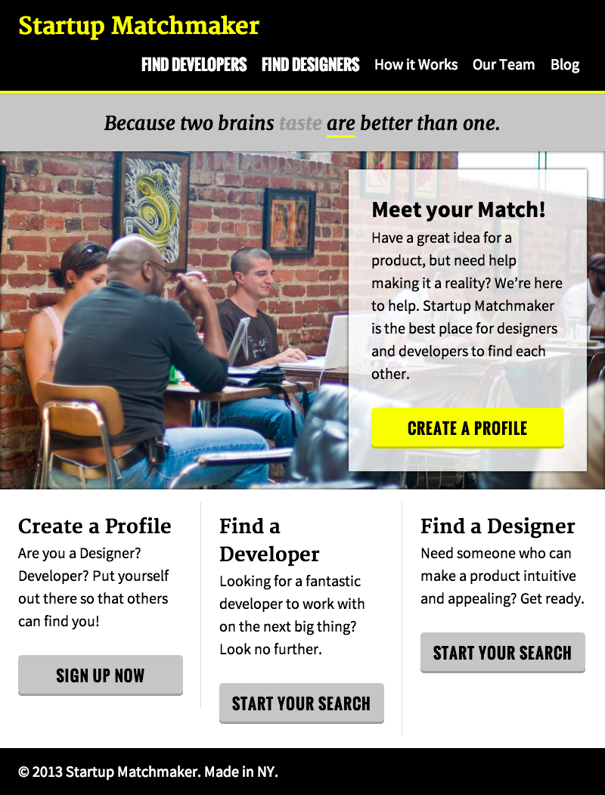

## HW w01d02 Matchmaker site

You are going to build this website from a comp, just like a real front-end developer would do. I've started you off with some boilerplate HTML and CSS to get this going but the rest is up to you.

This is the most advanced website you have built to date. Use all the skills I've been teaching you - think about semantic HTML, use a DOM tree, think about layout methods BEFORE you build and incorporate custom features where you feel they are necessary.

**Remember**: there are many ways to build this site and there aren't strictly wrong or right answers. Do your best and work in groups - this is how front-end developers get things done.

### Submission

This will be a 2 day assignment. This does **NOT** mean start tomorrrow. It is a big assignment and will take more than one night. **DO NOT PROCRASTINATE!!**

Follow the guidelines [here](https://github.com/fewd-puffin/homework-submission) or [here](https://github.com/fewd-puffin/hw-w01d1.5-git) to submit your homework. 